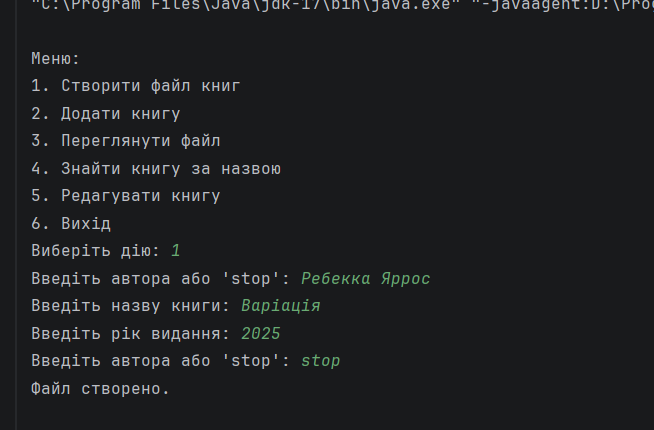
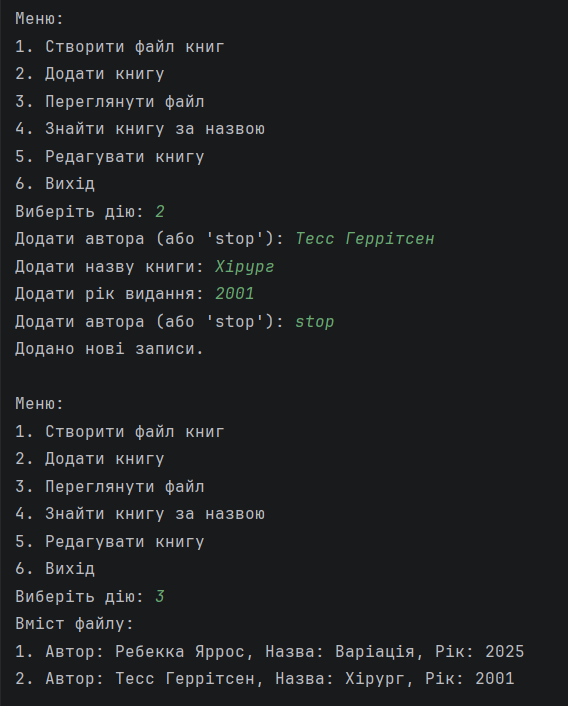
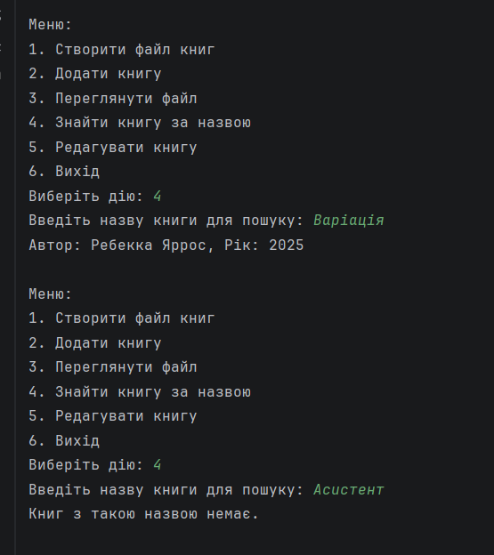
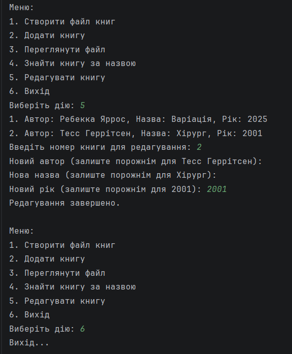

# Лабораторна робота №5
##  Дано файл, що містить відомості про книги: прізвище автора, назва і рік видання.
Визначити, чи є книга з заданою назвою. Якщо є, то повідомити прізвище автора та рік
видання. Якщо таких книг кілька, то повідомити дані про всі ці книги. Якщо таких книг
немає, то вивести відповідне повідомлення.

#При запуску програми в консольному меню виводиться список, де можна обрати необхідний пункт меню. Всі дані зберігаються у текстовому файлі books.txt у форматі: Автор, Назва, Рік.

## Створення файлу

## Додавання книги та перегляд результату

## Знаходження книги та її редагування

## Вихід

